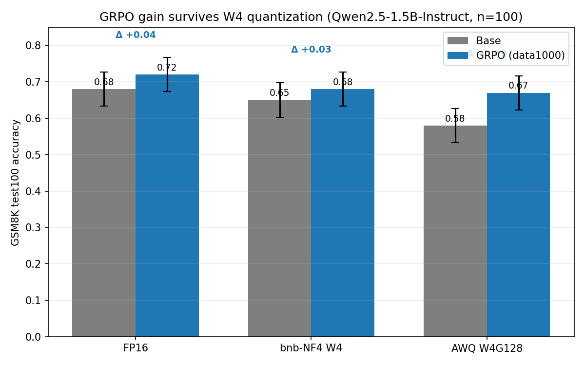

# Results — Does the GRPO gain survive 4-bit quantization?

Model: `Qwen2.5-1.5B-Instruct`. Task: GSM8K, chat-formatted, held-out `test100`.
GRPO recipe: `g8_dr100` (num_generations=8, dr_grpo, scale_rewards=none, beta=0,
temperature=1), 1000 prompts, ~2 epochs. Decoding: greedy, `max_new_tokens=512`,
stop on `<|im_end|>`/EOS. Eval quality on all rows: parse_rate 1.0, prompt_leak 0.0,
hit_max_new_tokens ≤ 0.03, ended_with_eos ≥ 0.97.

Final run job IDs (Great Lakes): train `51190676`, fp16 eval `51213892`,
base AWQ `51216404`, GRPO AWQ `51216405`, full matrix `51224222`.

## Accuracy matrix (correct / 100)

| Variant | FP16 | bnb-NF4 W4 | AWQ W4G128 |
| --- | ---: | ---: | ---: |
| Base | 0.68 (68) | 0.65 (65) | 0.58 (58) |
| GRPO (data1000) | 0.72 (72) | 0.68 (68) | 0.67 (67) |
| **Δ (GRPO − base)** | **+0.04** | **+0.03** | **+0.09** |

1-sigma binomial stderr at n=100 ≈ ±0.047.

## Gain survival

| Metric | Value | Reading |
| --- | ---: | --- |
| `delta_fp16` | +0.04 | small but clean held-out GRPO gain |
| `delta_w4` | +0.03 | gain present under bnb-NF4 W4 |
| `delta_awq` | +0.09 | gain present under AWQ |
| `gain_survival_w4` | −0.01 | FP16 gain survives bnb-NF4 W4 intact |
| `gain_survival_awq` | +0.05 | gain survives AWQ; AWQ appears more favorable to GRPO (candidate, ~1.3σ) |

## Quantization drops (FP16 − W4, per checkpoint)

| | bnb-NF4 W4 | AWQ W4G128 |
| --- | ---: | ---: |
| Base | 0.03 | 0.10 |
| GRPO | 0.04 | 0.05 |

Note the asymmetry under AWQ: base lost 0.10 but GRPO lost only 0.05. Suggestive that
GRPO's behavior is *more* robust to AWQ on this slice — but at n=100 this is ~1.3σ and
is reported as a candidate, not a claim.

## Weight-level quantizability (Day 4 diagnostic, 1.5B)

| Metric | Base | GRPO | Interpretation |
| --- | ---: | ---: | --- |
| max abs | 3.0625 | 3.0625 | identical |
| channel outlier frac | 0.0001645 | 0.0001703 | ~identical |
| abs outlier frac | 0.0012819 | 0.0012891 | ~identical |
| W4 relative MSE | 0.0155045 | 0.0155043 | ~identical |
| W4 SNR (dB) | 17.9587 | 17.9588 | ~identical |

The behavioral GRPO shift did **not** coincide with a global weight-outlier or
W4-reconstruction change.

## Conclusion

On this 1.5B / GSM8K / test100 setup, the GRPO FP16 gain survives both bnb-NF4 and AWQ
W4 quantization, and the weights quantize essentially identically to base. **No evidence
that this GRPO recipe makes the model harder to quantize.** Caveats: n=100 (modest power),
base already strong on GSM8K (limited headroom), and the "AWQ favors GRPO" effect needs
larger-n confirmation.

## Serving benchmark

Serving metrics are tracked separately in `results/serving_benchmark.md`. They are
not needed for the accuracy/quantization claim above. They are a deployment sanity
check for the same checkpoint family using vLLM on one A40. In the completed
small-model serving run, AWQ did not improve throughput over FP16, and the peak
memory column mostly reflects vLLM's KV-cache reservation policy. The honest
claim is deployment coverage plus measured serving behavior, not a serving
speedup.
